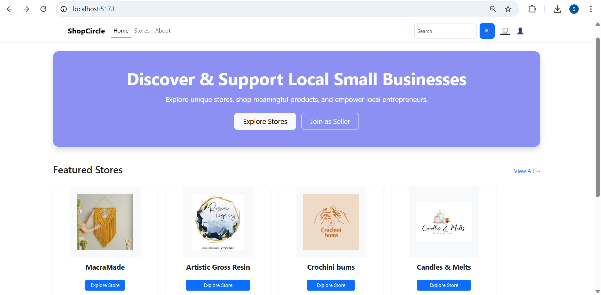
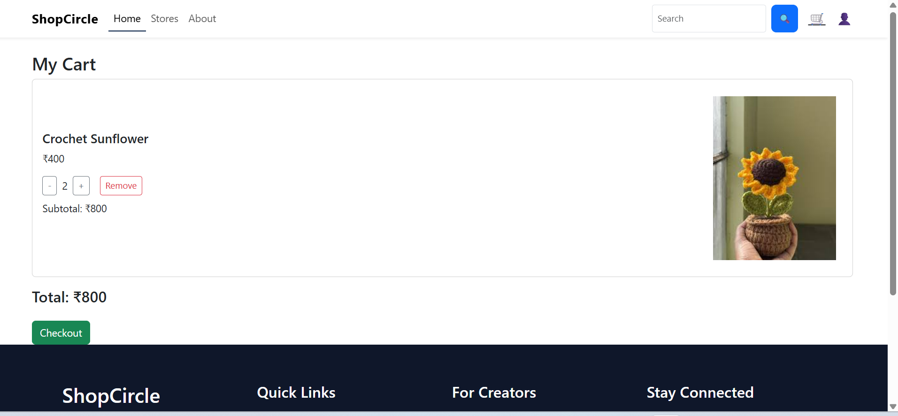
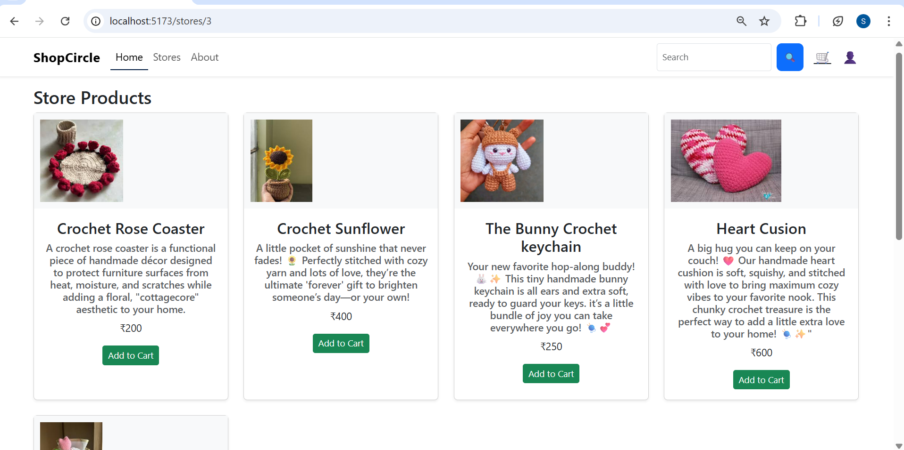

<h1 align="center">ShopCircle – Multi-Vendor Marketplace System</h1>

<h3 align="center">
A digital marketplace connecting small businesses with customers through individual online stores
</h3>

---

## 📖 About ShopCircle

ShopCircle is a **multi-vendor marketplace system** built to demonstrate real-world e-commerce backend design.  
It allows vendors to manage products while customers browse items, manage carts, and place orders through a secure and structured workflow.

The project focuses on **REST API development, authentication, database modeling, and layered architecture** using Spring Boot.

---

## ✨ Features

- Vendor onboarding and product management  
- Customer browsing and cart management  
- JWT-based authentication and authorization  
- Role-based access control (Customer / Vendor)  
- Order placement and order history tracking  
- RESTful APIs tested using Postman  

---

## 🛠️ Languages and Tools

<p align="left">
  <a href="https://www.java.com" target="_blank">
    
  </a>
  <a href="https://spring.io/" target="_blank">
    
  </a>
  <a href="https://reactjs.org/" target="_blank">
    
  </a>
  <a href="https://www.mysql.com/" target="_blank">
    
  </a>
  <a href="https://getbootstrap.com" target="_blank">
    
  </a>
  <a href="https://postman.com" target="_blank">
    
  </a>
</p>

---

## 🚀 Project Highlights

- Designed and developed RESTful APIs using Spring Boot  
- Implemented JWT-based authentication and role-based authorization  
- Applied layered architecture and object-oriented design principles  
- Designed MySQL database schema and entity relationships using JPA/Hibernate  
- Built complete end-to-end e-commerce workflow  
- Tested and validated APIs using Postman  

---

## 🏗️ Architecture

The backend follows a layered architecture:

- **Controller Layer** – Handles HTTP requests and responses  
- **Service Layer** – Contains business logic  
- **Repository Layer** – Manages database interaction using JPA  
- **Security Layer** – Implements JWT authentication and role-based authorization  
- **DTO Layer** – Transfers data between layers securely
- **Model Layer** – Represents database entities   
- **Exception Layer** –  Handles global and custom exceptions  

This separation ensures scalability, maintainability, and clean code structure.

---
## 📂 Project Structure
```multi-vendor-marketplace-system
│
├── backend
│   ├── controller
│   ├── dto
│   ├── service
│   ├── repository
│   ├── model
│   ├── exception
│   ├── security
│   └── config
│
├── frontend
│   ├── components
│   ├── pages
│   ├── services
│   ├── styles
│   └── assets
│
└── README.md
```
## 🔄 System Workflow

1. Vendors register and manage product listings  
2. Customers browse stores & products from multiple vendors  
3. Customers add items to cart and update quantities  
4. Orders are placed and stored securely  
5. Customers view order history  

---
## 🔗 Sample API Endpoints

- `POST /api/auth/login` – User authentication  
- `POST /api/auth/register` – User registration  
- `GET /api/products` – Fetch all products  
- `POST /api/cart` – Add item to cart  
- `PUT /api/cart/{id}` – Update cart item quantity  
- `POST /api/orders` – Place an order  
- `GET /api/orders/user/{id}` – View order history  

---
## ▶️ How to Run the Project

### 🔹 Backend Setup

1. Navigate to backend folder: cd backend
2. Configure MySQL database in `application.properties`
3. Run Spring Boot application
4. Backend runs on:  `http://localhost:8080`

### 🔹 Frontend Setup

1. Navigate to frontend folder: cd frontend
2. Install dependencies: npm install
3. Start development server: npm run dev
4. Frontend runs on:  `http://localhost:5173`

---
## 🎯 Impact

- Simulates real-world multi-vendor marketplace behavior  
- Ensures secure and scalable backend architecture  
- Improves maintainability through modular design  

---
## 📸 Screenshots

### 🏠 Home Page
<p align="center">
  
</p>


### 🛒 Cart Page
<p align="center">
  
</p>

### 🏬 Store Page
<p align="center">
  
</p>


## 👤 Author

**Shramika Poojary**  
GitHub: [ShramikaPoojary](https://github.com/shramika-poojary)

## 🔮 Future Enhancements
- Email notifications  
- Cloud deployment 
